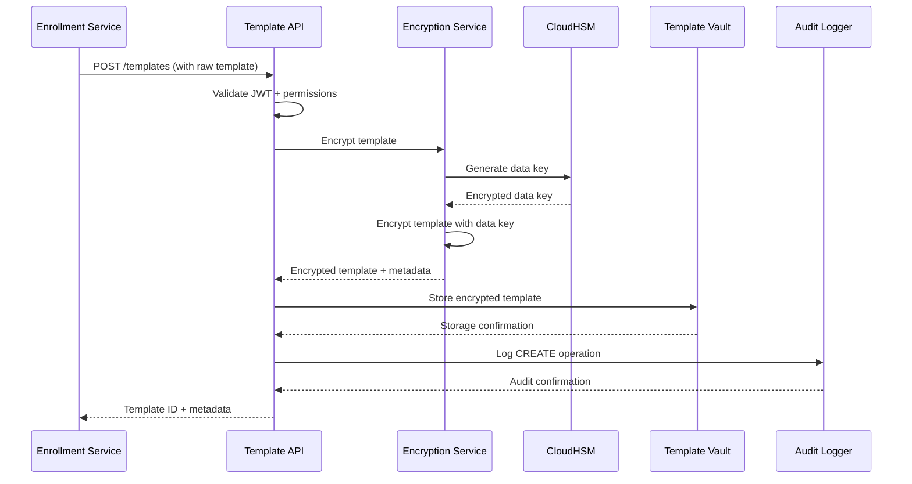
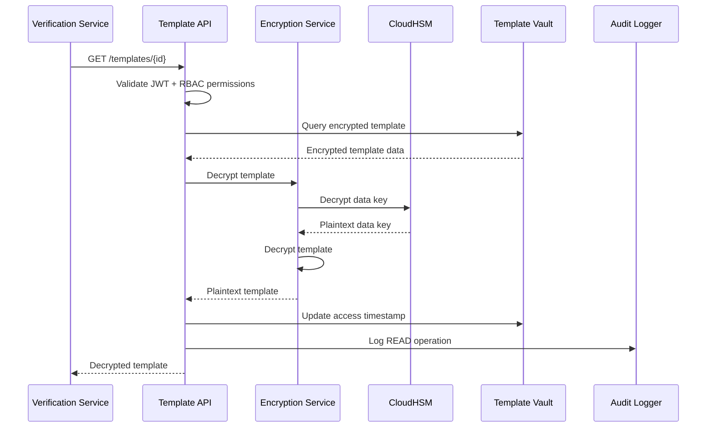

# Biometric Template Storage System - Architecture

> **Proyecto**: CORE-2024-01-BTS
> **Versión**: 1.5.0
> **Fecha**: 2024-03-15
> **Arquitecto**: Security Lead - Ana Martín

## 1. Introducción y Metas

### 1.1 Requerimientos de Seguridad Críticos
Este sistema almacena templates biométricos (datos categoría especial GDPR Art. 9):
- **Encryption**: AES-256 at rest, TLS 1.3 in transit
- **Access Control**: Zero-trust, principio de menor privilegio
- **Compliance**: GDPR, SOC2, ISO 27001, PSD2
- **Auditabilidad**: Inmutable audit trail, trazabilidad completa

### 1.2 Requerimientos de Performance
- **Latency**: < 50ms para retrieval de templates
- **Throughput**: 5,000 ops/segundo peak
- **Storage**: 100M+ templates, crecimiento 20%/año
- **Availability**: 99.99% con backup geo-replicado

### 1.3 Restricciones Regulatorias
- **Data minimization**: Solo templates, NUNCA imágenes originales
- **Retention limits**: 7 años máximo, auto-purge
- **Right to erasure**: GDPR Art. 17 - borrado verificable
- **Data portability**: GDPR Art. 20 - exportación segura

## 2. Vista de Contexto (C4 Nivel 1)

```
┌─────────────────────────────────────────────────────────────────┐
│                      External Boundaries                       │
├─────────────────────────────────────────────────────────────────┤
│                                                                │
│  [Verification Services] ──┐                                   │
│  [Enrollment Services] ────┼── [Template Storage] ──── [HSM]   │
│  [Audit & Compliance] ─────┘         │                         │
│                                      │                         │
│  [GDPR Management] ──────────────────┤                         │
│  [Backup & Recovery] ────────────────┤                         │
│  [Key Management] ───────────────────┘                         │
│                                                                │
└─────────────────────────────────────────────────────────────────┘
```

### 2.1 Actores del Sistema
- **Verification Services**: Selphi, SelphID, Voice services
- **Enrollment Services**: Template generation during onboarding
- **GDPR Management**: Data subject rights, consent management
- **Compliance & Audit**: SOX, SOC2, regulatory reporting

## 3. Vista de Contenedores (C4 Nivel 2)

### 3.1 Core Storage Containers

```yaml
Template Storage API:
  Technology: Go + Gin framework
  Responsibilities:
    - CRUD operations on encrypted templates
    - Access control enforcement
    - Audit logging
    - Rate limiting per client

Template Vault:
  Technology: PostgreSQL 15 + pgcrypto
  Responsibilities:
    - Encrypted template storage
    - Metadata indexing
    - Backup coordination
    - Query optimization

Encryption Service:
  Technology: Go + PKCS#11 HSM interface
  Responsibilities:
    - Template encryption/decryption
    - Key rotation management
    - HSM communication
    - Cryptographic operations

Audit Logger:
  Technology: Go + Kafka + Elasticsearch
  Responsibilities:
    - Immutable audit trail
    - Real-time monitoring
    - Compliance reporting
    - Anomaly detection
```

### 3.2 Supporting Services

```yaml
Key Management Service:
  Technology: HashiCorp Vault + AWS CloudHSM
  Responsibilities:
    - Master key management
    - Key rotation policies
    - Certificate lifecycle
    - Secret distribution

GDPR Compliance Engine:
  Technology: Python + Celery
  Responsibilities:
    - Data subject rights processing
    - Retention policy enforcement
    - Consent verification
    - Data portability
```

## 4. Vista de Componentes (C4 Nivel 3)

### 4.1 Template Storage API Components

```go
// Core API Components
type TemplateStorageService struct {
    // Authentication & Authorization
    AuthValidator    *JWTValidator
    PermissionEngine *RBACEngine

    // Business Logic
    TemplateManager  *TemplateManager
    CryptoService   *EncryptionService

    // Infrastructure
    Repository      *TemplateRepository
    AuditLogger     *AuditLogger
    MetricsCollector *PrometheusCollector
}

type TemplateManager struct {
    // Template Operations
    Create(template *BiometricTemplate) error
    Retrieve(templateID string, purpose Purpose) (*BiometricTemplate, error)
    Update(templateID string, template *BiometricTemplate) error
    Delete(templateID string, reason DeletionReason) error

    // Batch Operations
    BulkRetrieve(templateIDs []string) ([]*BiometricTemplate, error)
    BulkDelete(criteria DeletionCriteria) (*DeletionReport, error)
}
```

### 4.2 Encryption Service Components

```go
type EncryptionService struct {
    HSMClient    *CloudHSMClient
    KeyRotator   *KeyRotationManager
    CryptoOps    *CryptographicOperations
}

type CryptographicOperations struct {
    // Template Encryption
    EncryptTemplate(plaintext []byte, keyID string) (*EncryptedData, error)
    DecryptTemplate(encrypted *EncryptedData) ([]byte, error)

    // Key Management
    GenerateDataKey() (*DataKey, error)
    RotateKey(oldKeyID string) (*KeyRotationResult, error)

    // Digital Signatures
    SignTemplate(template *BiometricTemplate) (*DigitalSignature, error)
    VerifySignature(template *BiometricTemplate, signature *DigitalSignature) bool
}
```

## 5. Modelo de Datos Seguro

### 5.1 Estructura de Template Encriptado

```sql
-- Templates table (main storage)
CREATE TABLE biometric_templates (
    template_id         UUID PRIMARY KEY,
    user_id            UUID NOT NULL,
    template_type      VARCHAR(50) NOT NULL, -- 'face', 'voice', 'document'

    -- Encrypted template data
    encrypted_template  BYTEA NOT NULL,        -- AES-256 encrypted template
    encryption_key_id   VARCHAR(100) NOT NULL, -- HSM key reference
    encryption_version  INTEGER NOT NULL,      -- For key rotation
    digital_signature   BYTEA NOT NULL,        -- Tamper detection

    -- Metadata (searchable, non-sensitive)
    template_version    VARCHAR(20) NOT NULL,  -- Algorithm version
    quality_score       DECIMAL(3,2),          -- Template quality
    confidence_level    DECIMAL(3,2),          -- Extraction confidence

    -- GDPR & Compliance
    consent_id          UUID,                  -- Linked consent record
    lawful_basis        VARCHAR(50) NOT NULL,  -- GDPR Art. 6 basis
    retention_until     TIMESTAMP NOT NULL,    -- Auto-deletion date
    data_source         VARCHAR(100) NOT NULL, -- Origin service

    -- Audit fields
    created_at          TIMESTAMP NOT NULL DEFAULT NOW(),
    created_by          VARCHAR(100) NOT NULL,
    last_accessed       TIMESTAMP,
    access_count        INTEGER DEFAULT 0,

    -- Soft deletion
    deleted_at          TIMESTAMP NULL,
    deletion_reason     VARCHAR(200),
    deleted_by          VARCHAR(100)
);

-- Indexes for performance (no sensitive data)
CREATE INDEX idx_templates_user_type ON biometric_templates(user_id, template_type);
CREATE INDEX idx_templates_retention ON biometric_templates(retention_until) WHERE deleted_at IS NULL;
CREATE INDEX idx_templates_created ON biometric_templates(created_at);
```

### 5.2 Audit Trail Schema

```sql
-- Immutable audit log
CREATE TABLE template_audit_log (
    audit_id           UUID PRIMARY KEY,
    template_id        UUID NOT NULL,
    operation          VARCHAR(20) NOT NULL, -- CREATE, READ, UPDATE, DELETE

    -- Request context
    user_id            UUID,
    client_id          VARCHAR(100) NOT NULL,
    session_id         VARCHAR(100),
    request_id         VARCHAR(100) NOT NULL,

    -- Security context
    ip_address         INET,
    user_agent         VARCHAR(500),
    auth_method        VARCHAR(50),

    -- Compliance
    legal_basis        VARCHAR(200),
    purpose            VARCHAR(200) NOT NULL,

    -- Technical details
    api_endpoint       VARCHAR(200) NOT NULL,
    http_method        VARCHAR(10) NOT NULL,
    response_status    INTEGER NOT NULL,
    processing_time_ms INTEGER,

    -- Timestamps
    event_timestamp    TIMESTAMP NOT NULL DEFAULT NOW(),

    -- Integrity
    audit_hash         VARCHAR(128) NOT NULL -- Hash of record for tamper detection
);

-- Partitioned by month for performance
CREATE INDEX idx_audit_template_time ON template_audit_log(template_id, event_timestamp DESC);
CREATE INDEX idx_audit_user_time ON template_audit_log(user_id, event_timestamp DESC);
```

## 6. Flujos de Seguridad

### 6.1 Template Creation Flow



### 6.2 Template Retrieval Flow



## 7. Vista de Despliegue

### 7.1 Production Infrastructure

```yaml
Template Storage API:
  - 3x instances (active-active)
  - Auto-scaling: 3-10 instances
  - Instance type: c5.xlarge
  - Container: Docker + Kubernetes
  - Deployment: Blue-green

Template Database:
  - PostgreSQL 15 cluster
  - Primary + 2 read replicas
  - Instance type: r6i.2xlarge
  - Storage: Encrypted EBS gp3
  - Backup: Point-in-time recovery

Encryption Service:
  - 2x instances (active-passive)
  - Instance type: c5.large
  - HSM: AWS CloudHSM cluster
  - Key rotation: Automated weekly

Audit Infrastructure:
  - Kafka cluster (3 brokers)
  - Elasticsearch cluster (5 nodes)
  - Retention: 7 years (compliance)
  - Backup: Daily snapshots to S3
```

### 7.2 Network Security

```
Internet ──→ WAF ──→ ALB ──→ Template API (DMZ)
                               │
                               ▼
                     Private Subnet (App Tier)
                               │
                               ▼
              ┌────────────────┼────────────────┐
              ▼                ▼                ▼
      PostgreSQL      Encryption Service    CloudHSM
    (Private Subnet)   (Private Subnet)   (Dedicated)
```

## 8. Compliance & Governance

### 8.1 GDPR Implementation

```yaml
Data Minimization:
  - Only biometric templates stored
  - No raw images or audio
  - Metadata limited to operational needs
  - Regular data inventory audits

Purpose Limitation:
  - Purpose declared at collection
  - Access control by purpose
  - Regular purpose review
  - Automated purpose expiry

Retention Management:
  - Maximum 7-year retention
  - Automated deletion workflows
  - Deletion verification
  - Audit trail of deletions

Rights Implementation:
  - Right of access (Art. 15)
  - Right to rectification (Art. 16)
  - Right to erasure (Art. 17)
  - Right to data portability (Art. 20)
```

### 8.2 Security Controls (SOC2)

```yaml
Access Controls:
  - Multi-factor authentication required
  - Role-based access control (RBAC)
  - Principle of least privilege
  - Regular access review (quarterly)

Change Management:
  - All changes via peer-reviewed PRs
  - Automated testing pipeline
  - Rollback procedures documented
  - Change approval workflow

Monitoring & Incident Response:
  - 24/7 security monitoring
  - Automated anomaly detection
  - Incident response plan tested
  - Security awareness training
```

## 9. Disaster Recovery & Business Continuity

### 9.1 Backup Strategy

```yaml
Database Backups:
  - Continuous backup to S3 (cross-region)
  - Point-in-time recovery capability
  - Recovery time objective: 15 minutes
  - Recovery point objective: 5 minutes

HSM Key Backup:
  - Keys backed up to separate HSM
  - Offline key escrow for disaster recovery
  - Geographic separation required
  - Annual recovery testing

Application Data:
  - Configuration backed up daily
  - Container images in multiple registries
  - Infrastructure as Code in version control
  - Runbook documentation maintained
```

### 9.2 Disaster Scenarios

| Scenario | Impact | Recovery Time | Recovery Procedure |
|----------|--------|---------------|-------------------|
| Single AZ failure | 0% (multi-AZ deployment) | 0 minutes | Automatic failover |
| Region failure | < 5% degraded performance | 30 minutes | Manual failover to DR region |
| HSM failure | Read-only mode | 60 minutes | Activate backup HSM, key restoration |
| Data corruption | Partial data loss | 2-4 hours | Point-in-time recovery, validate integrity |
| Security breach | Service shutdown | 24-48 hours | Incident response, forensics, remediation |

## 10. Monitoreo y Métricas

### 10.1 Security Metrics

```yaml
Access Patterns:
  - failed_authentication_attempts_total
  - unauthorized_access_attempts_total
  - privilege_escalation_attempts_total
  - suspicious_query_patterns_total

Encryption Health:
  - encryption_operation_duration_ms
  - key_rotation_success_rate
  - hsm_availability_percent
  - crypto_operation_errors_total

Compliance Metrics:
  - gdpr_request_processing_time_hours
  - data_retention_compliance_percent
  - audit_log_integrity_status
  - backup_success_rate_percent
```

### 10.2 Business Metrics

```yaml
Performance:
  - template_retrieval_latency_ms (P95: <50ms)
  - template_storage_latency_ms (P95: <100ms)
  - template_throughput_ops_per_second
  - database_connection_pool_usage

Availability:
  - service_availability_percent (Target: 99.99%)
  - planned_maintenance_downtime_minutes
  - unplanned_downtime_incidents_total
  - template_accessibility_rate

Data Quality:
  - template_corruption_rate
  - encryption_integrity_failures
  - backup_restoration_success_rate
  - data_consistency_check_results
```

## 11. Roadmap & Evolution

### 11.1 Q2 2024: Enhanced Privacy
- Implement homomorphic encryption for searches
- Deploy differential privacy for analytics
- Add biometric template anonymization
- Enhance consent management granularity

### 11.2 Q3 2024: Performance & Scale
- Implement template clustering for similarity searches
- Deploy machine learning for access pattern optimization
- Add predictive scaling based on usage patterns
- Optimize database queries and indexes

### 11.3 Q4 2024: Advanced Security
- Deploy quantum-resistant cryptography
- Implement zero-knowledge proof verification
- Add blockchain-based audit trail
- Enhance threat detection with AI/ML

---

**Security Review**: ✅ Approved by CISO
**Compliance Review**: ✅ Approved by DPO
**Architecture Review**: ✅ Approved by CTO
**Next Review Date**: 2024-09-15