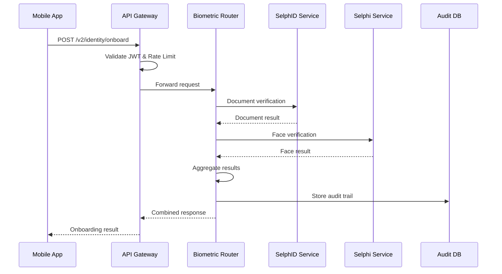
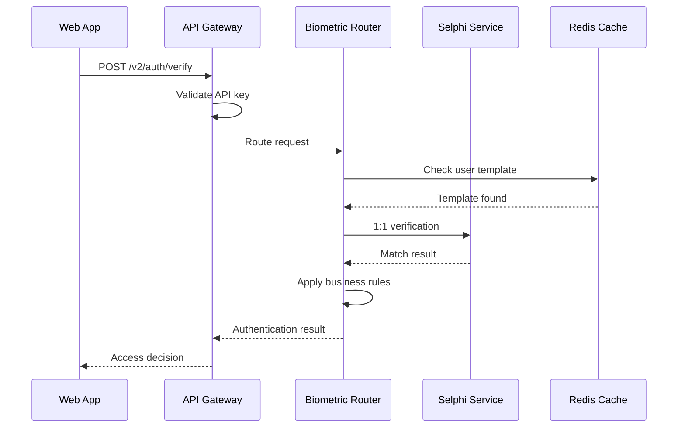

# LIDR Platform API Gateway - Architecture

> **Proyecto**: PLAT-2024-02-GW
> **Versión**: 3.0.0
> **Fecha**: 2024-03-15
> **Arquitecto**: Platform Lead - Carlos Ruiz

## 1. Introducción y Metas

### 1.1 Requerimientos

El API Gateway orchestrates all biometric verification workflows through a unified interface:

- **Latency**: < 300ms for routing, < 2.5s end-to-end
- **Throughput**: 10,000 concurrent verifications
- **Availability**: 99.95% with graceful degradation
- **Compliance**: PSD2, GDPR, SOC2 Type II

### 1.2 Architectural Qualities

- **Security**: mTLS, JWT validation, rate limiting, RBAC
- **Resilience**: Circuit breakers, retry policies, bulkhead isolation
- **Observability**: Distributed tracing, business metrics, SLA monitoring
- **Extensibility**: Plugin architecture for new verification methods

## 2. Business Context

### 2.1 Supported Workflows

```yaml
Identity Onboarding:
  - Document capture (SelphID)
  - Facial verification (Selphi)
  - Voice enrollment (Voice)
  - Liveness detection (anti-spoofing)

Authentication:
  - 1:1 facial verification
  - Voice verification
  - Behavioral biometrics
  - Step-up authentication

Compliance:
  - AML/KYC document verification
  - PSD2 SCA (Strong Customer Authentication)
  - eIDAS identity proofing
  - GDPR consent management
```

### 2.2 Client Types

- **Banking Apps**: iOS/Android native SDKs
- **Web Applications**: JavaScript SDK + WebRTC
- **Backend Services**: REST API integrations
- **Third-party ISVs**: White-label solutions

## 3. Vista de Contexto (C4 Nivel 1)

```
┌─────────────────────────────────────────────────────────────┐
│                    External Systems                         │
├─────────────────────────────────────────────────────────────┤
│ [Client Apps] ──────┐                                      │
│ [Partner APIs] ─────┼─── [API Gateway] ──── [LIDR Core] │
│ [Admin Dashboard] ──┘                │                      │
│                                      │                      │
│ [Identity Providers] ────────────────┤                      │
│ [Notification Services] ─────────────┤                      │
│ [Audit & Compliance] ────────────────┘                      │
└─────────────────────────────────────────────────────────────┘
```

### 3.1 External Systems

- **Keycloak**: OpenID Connect identity provider
- **Elasticsearch**: Audit logs and search
- **Kafka**: Event streaming for workflows
- **Vault**: Secrets and certificate management

## 4. Vista de Contenedores (C4 Nivel 2)

### 4.1 Core Containers

```yaml
API Gateway:
  Technology: Kong + Lua plugins
  Ports: 443 (HTTPS), 9000 (Admin API)
  Responsibilities:
    - Request routing and load balancing
    - Authentication and authorization
    - Rate limiting and DDoS protection
    - Request/response transformation

Biometric Router:
  Technology: Node.js + Express
  Responsibilities:
    - Workflow orchestration
    - Service discovery
    - Business rule execution
    - Async processing coordination

Service Registry:
  Technology: Consul
  Responsibilities:
    - Service discovery
    - Health checking
    - Configuration management
    - Load balancing weights

Message Broker:
  Technology: Apache Kafka
  Responsibilities:
    - Event-driven workflows
    - Async verification processing
    - Audit trail streaming
    - Dead letter handling
```

### 4.2 Downstream Services

```yaml
SelphID Service:
  Endpoint: /v2/document/verify
  SLA: 1.5s P95, 99.9% availability

Selphi Service:
  Endpoint: /v2/face/verify
  SLA: 2s P95, 99.95% availability

Voice Service:
  Endpoint: /v2/voice/verify
  SLA: 3s P95, 99.5% availability

Behavioral Service:
  Endpoint: /v2/behavior/analyze
  SLA: 500ms P95, 99% availability
```

## 5. Vista de Componentes (C4 Nivel 3)

### 5.1 Gateway Layer Components

```typescript
interface ApiGatewayComponents {
  // Authentication & Authorization
  JwtValidator: {
    responsibilities: [
      "Validate JWT tokens",
      "Extract claims",
      "Token refresh",
    ];
    dependencies: ["Keycloak", "Redis Cache"];
  };

  RateLimiter: {
    responsibilities: [
      "Rate limiting per client",
      "DDoS protection",
      "Quota management",
    ];
    algorithms: ["Token bucket", "Sliding window", "Fixed window"];
  };

  // Routing & Load Balancing
  ServiceRouter: {
    responsibilities: [
      "Route to backend services",
      "Load balancing",
      "Health checks",
    ];
    strategies: ["Round robin", "Weighted", "Least connections"];
  };

  CircuitBreaker: {
    responsibilities: ["Failure detection", "Fast failure", "Auto recovery"];
    patterns: ["Circuit breaker", "Bulkhead", "Timeout"];
  };
}
```

### 5.2 Orchestration Layer

```typescript
interface OrchestrationComponents {
  WorkflowEngine: {
    responsibilities: [
      "Multi-step verification flows",
      "Business rule execution",
      "State machine management",
    ];
    patterns: ["Saga pattern", "CQRS", "Event sourcing"];
  };

  BiometricValidator: {
    responsibilities: [
      "Input validation",
      "Format conversion",
      "Quality assessment",
    ];
    validations: ["Image quality", "Document format", "Audio quality"];
  };

  ResultAggregator: {
    responsibilities: [
      "Combine multiple verification results",
      "Confidence scoring",
      "Decision logic",
    ];
    algorithms: ["Weighted average", "ML fusion", "Rule-based"];
  };
}
```

## 6. Flujos de Datos Principales

### 6.1 Identity Onboarding Flow



### 6.2 Authentication Flow



## 7. Vista de Despliegue

### 7.1 Production Environment

```yaml
Load Balancer:
  - AWS Application Load Balancer
  - SSL termination (TLS 1.3)
  - WAF protection
  - Health checks

API Gateway Cluster:
  - 3x Kong instances (active-active)
  - Auto-scaling: 3-10 instances
  - Instance type: c5.2xlarge
  - Deployment: Blue-green

Biometric Router:
  - 5x Node.js instances
  - Auto-scaling: 5-20 instances
  - Instance type: c5.xlarge
  - Deployment: Rolling update

Service Discovery:
  - 3x Consul servers (multi-AZ)
  - Instance type: m5.large
  - Backup: Daily snapshots

Message Broker:
  - 3x Kafka brokers (MSK managed)
  - Replication factor: 3
  - Retention: 7 days
```

### 7.2 Network Architecture

```
Internet ──→ CloudFlare ──→ AWS ALB ──→ Kong Gateway
                                         │
                                         ▼
                               Private Subnet (DMZ)
                                         │
                                         ▼
                              Biometric Router Cluster
                                         │
                                         ▼
                               Private Subnet (Core)
                                         │
                                         ▼
                   ┌─────────────────────┼─────────────────────┐
                   ▼                     ▼                     ▼
             SelphID Service      Selphi Service      Voice Service
```

## 8. Seguridad

### 8.1 Security Layers

```yaml
Transport Security:
  - TLS 1.3 encryption
  - Certificate pinning
  - HSTS headers
  - Perfect forward secrecy

Authentication:
  - OAuth 2.0 + PKCE
  - JWT with RS256 signing
  - API key rotation
  - mTLS for service-to-service

Authorization:
  - RBAC (Role-Based Access Control)
  - Scope-based permissions
  - Resource-level authorization
  - Dynamic policy evaluation

Data Protection:
  - Request/response encryption
  - PII field redaction in logs
  - Biometric template encryption
  - Key rotation (90 days)
```

### 8.2 Security Controls

```yaml
Rate Limiting:
  - Per-client: 1000 req/min
  - Per-IP: 100 req/min
  - Per-endpoint: Custom limits
  - Burst protection: 2x normal rate

DDoS Protection:
  - CloudFlare protection
  - AWS Shield Advanced
  - Rate limiting at multiple layers
  - Automatic black-hole routing

Audit & Compliance:
  - All requests logged (no PII)
  - Immutable audit trail
  - GDPR compliance
  - SOC2 controls
```

## 9. Observabilidad

### 9.1 Métricas Técnicas

```yaml
Gateway Metrics:
  - gateway_request_duration_ms (P50, P95, P99)
  - gateway_request_total (by endpoint, status)
  - gateway_active_connections
  - gateway_circuit_breaker_state

Business Metrics:
  - verification_success_rate (by type)
  - onboarding_completion_rate
  - authentication_attempts_total
  - false_accept_rate, false_reject_rate

SLA Metrics:
  - endpoint_availability_percent
  - end_to_end_latency_ms
  - error_rate_percent
  - service_dependency_health
```

### 9.2 Monitoring & Alerting

```yaml
Infrastructure:
  - Datadog APM (distributed tracing)
  - Prometheus + Grafana (metrics)
  - ELK Stack (logging)
  - PagerDuty (alerting)

Business Intelligence:
  - Real-time dashboards
  - SLA compliance tracking
  - Client usage analytics
  - Security incident detection

Alert Conditions:
  - P95 latency > 2.5s (5 min window)
  - Error rate > 0.1% (2 min window)
  - Circuit breaker OPEN (immediate)
  - Service dependency DOWN (1 min window)
```

## 10. Decisiones Arquitectónicas

### ADR-001: Kong vs Istio Service Mesh

- **Decision**: Kong API Gateway + minimal service mesh
- **Rationale**: Simpler ops, better plugin ecosystem, existing team knowledge
- **Consequences**: Less advanced traffic management, acceptable for current scale

### ADR-002: Synchronous vs Event-Driven Architecture

- **Decision**: Hybrid: sync for real-time verification, async for workflows
- **Rationale**: User experience requires immediate feedback, but complex workflows benefit from async
- **Consequences**: More complex architecture but better UX and resilience

### ADR-003: Multi-tenant vs Single-tenant

- **Decision**: Multi-tenant with namespace isolation
- **Rationale**: Cost efficiency, easier updates, regulatory compliance achievable
- **Consequences**: More complex security model, but acceptable with proper isolation

## 11. Roadmap & Evolution

### 11.1 Q2 2024: Performance Optimization

- Implement GraphQL federation
- Add response caching layer
- Optimize serialization/deserialization
- Geographic load balancing

### 11.2 Q3 2024: Advanced Security

- Zero-trust network model
- Biometric template tokenization
- Advanced threat detection
- Compliance automation

### 11.3 Q4 2024: Edge Computing

- CDN integration for static assets
- Edge computing for preprocessing
- Regional data residency
- Offline capability support

---

**Reviewed by**: Security Lead, Platform Lead, DevOps Lead
**Approval date**: 2024-03-15
**Next review**: 2024-09-15
